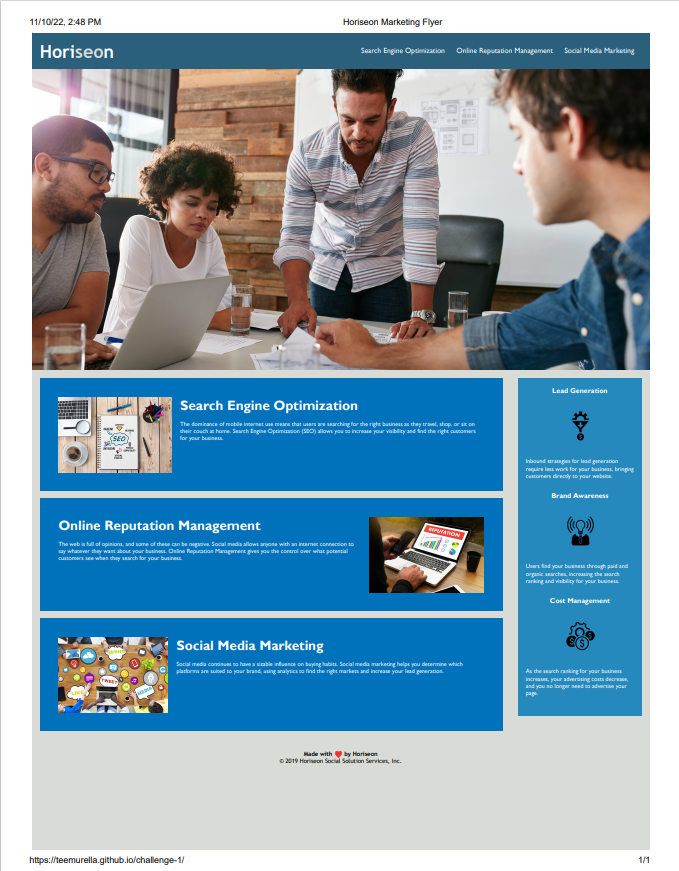

# <Module-1-Challenge>

## Description

For this module, the focus was accessibility.  The marketing agency asked to optimize their search engines. In order to optimize, I had to clean up the css and HTML using proper semantic HTML elements.  To make the code easier to read, I added proper semantic elements and alt attributes. By optimizing the css, web pages render faster and the code is easier to read and understand. 

## Installation

First, we pulled the starter code from Gitlab.  Then, we made a copy of the code to the local repository.  From there, I used the copy on the local repository to save and track the changes I made.

## Usage

This module helped me understand HTML and CSS optimization.  With an optimized HTML and CSS, other viewers are able to interpret and understand the code much clearer.  This will help with further development of the code and easier viewing for others.

https://teemurella.github.io/challenge-1/